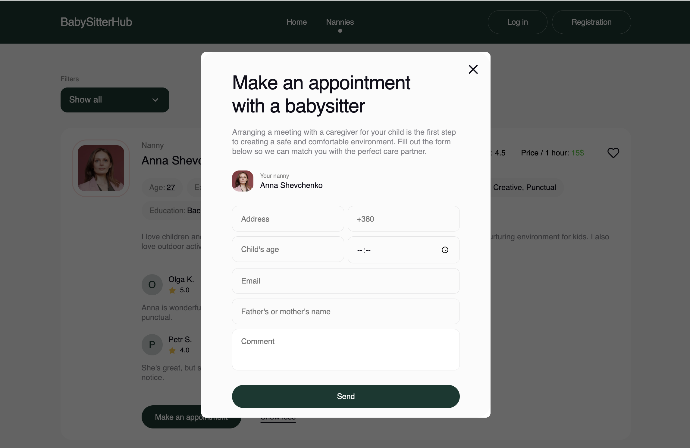

# BabySitterHub - React Application

## Table of contents

- [Description](#description)
- [Screenshots](#screenshots)
- [Features](#features)
- [Technologies](#technologies)
- [Installation](#installation)
- [Project Layout and Requirements](#project-layout-and-requirements)
- [Contributing](#contributing)

## Description

BabySitterHub offers a convenient platform for families seeking reliable and trustworthy childcare providers for their children. With our user-friendly interface, finding the perfect nanny to meet your family's needs has never been easier. Our application is designed with three main pages specifically tailored to address your childcare requirements.

## Screenshots


_Welcome Home page_

_Nannies catalog page_

_Favorites page_

_Appointment form for booking nannies_

## Features

- View a list of available nannies with photos, ratings, and information about them.
- Ability to sort nannies by various criteria such as popularity, price, alphabetically, etc.
- Read reviews about nannies.
- Booking time with a selected nanny.
- Adding nannies to favorites and viewing a list of favorite nannies.
- All data is saved for a specific user.

## Technologies

- React.js for the frontend.
- Firebase Authentication to handle user authentication and authorization processes.
- Firebase Realtime Database for storing and managing application data in real-time.
- Styled-components for styling components.
- React Router for routing.

## Installation

1. **Clone the repository:**

   ```bash
   git clone https://github.com/KluDan/BabySitterHub.git

   ```

2. **Install dependencies:**

   ```bash
   npm install

   ```

3. **Create a Firebase configuration file `.env` and add your settings:**

   ```bash
   VITE_API_KEY=YOUR_API_KEY
   VITE_AUTH_DOMAIN=YOUR_AUTH_DOMAIN
   VITE_DATABASE_URL=YOUR_DATABASE_URL
   VITE_PROJECT_ID=YOUR_PROJECT_ID
   VITE_STORAGE_BUCKET=YOUR_STORAGE_BUCKET
   VITE_MESSAGING_SENDER_ID=YOUR_MESSAGING_SENDER_ID
   VITE_APP_ID=YOUR_APP_ID
   ```

4. **Run the application:**
   ```bash
   npm run dev
   ```

## Project Layout and Requirements

This repository contains essential documents and resources for the project development. Below are the key references:

1. **Project Layout**:

   - [Project Mockup](https://www.figma.com/file/u36ajEOsnwio2GDGiabVPD/Nanny-Sevices?type=design&node-id=0-1&mode=design&t=01CgTCIu4cCSpGmU-0): Explore the visual representation of the project's user interface and design.

2. **Project Requirements**:
   - [Project Requirements](https://docs.google.com/document/d/19ugM1gvOw81nCyALr4EZs3dmv6OfJm94VjupcytbnJY/edit): Access the detailed technical specifications and functional requirements for the project.

## Contributing

If you have suggestions for improving the project or found a bug, please create a new Issue or Pull Request.
